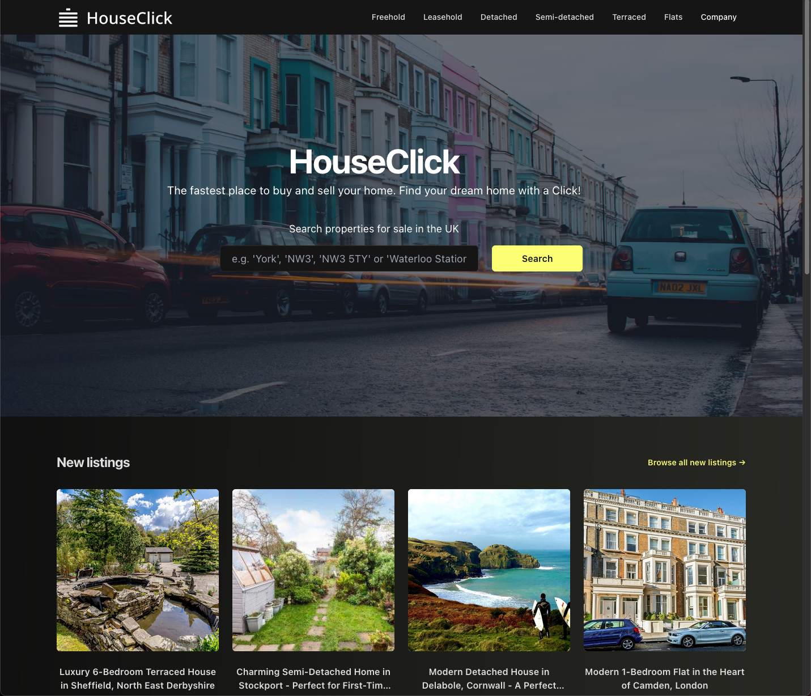

# HouseClick - ClickHouse + Supabase demo

HouseClick is a fake estate agency business, powered by Supabase and ClickHouse via the ClickHouse Foreign Data Wrapper. Supabase for transactional data and application state, ClickHouse for analytics - all the through the Supabase API.

This demo complements the blog post [Adding Real Time Analytics to a Supabase Application](https://clickhouse.com/blog/adding-real-time-analytics-to-a-supabase-application). This requires you to have the Foreign Data Wrapper for ClickHouse available in your Supabase project.

**Important**

- This is a demo only. 
- The code has no tests. 
- Minimal code comments. 
- Rough and ready. 
- Use for inspiration only. 
- PRs welcome to improve the code.
- Due to concerns regards image writes, we do not generate a dataset. Steps to generate are included.
- This requires the Foreign Data Wrapper (FDW) for ClickHouse to be available in Supabase.



## Setup

### 1. Requirements

- Python 3.10+ - for data generation scripts
- Node v16.15.1+
- Yarn 1.22.19
- Supabase (free tier is sufficient) account or local instance. You will need Foreign Data Wrappers enabled on this instance.
- OpenAPI key. $10 free credit is sufficient to generate 1000 properties. This is used to generated property descriptions.

### 2. Installation

```bash
git clone git@github.com:ClickHouse/house-prices.git
# setup script dependencies
cd scripts
# optionally create a virutal env e.g. virtualenv -p python3 .venv && source .venv
pip install -r requirements.txt
# Install frontend
cd ../house-click
yarn install
```

### 3. Loading data into ClickHouse

From the ClickHouse client. This data is around 28m rows and takes several minutes to load on most internet connections. Further details [here](https://clickhouse.com/docs/en/getting-started/example-datasets/uk-price-paid).

```sql
CREATE TABLE uk_price_paid
(
    price UInt32,
    date Date,
    postcode1 LowCardinality(String),
    postcode2 LowCardinality(String),
    type Enum8('terraced' = 1, 'semi-detached' = 2, 'detached' = 3, 'flat' = 4, 'other' = 0),
    is_new UInt8,
    duration Enum8('freehold' = 1, 'leasehold' = 2, 'unknown' = 0),
    addr1 String,
    addr2 String,
    street LowCardinality(String),
    locality LowCardinality(String),
    town LowCardinality(String),
    district LowCardinality(String),
    county LowCardinality(String)
)
ENGINE = MergeTree
ORDER BY (postcode1, postcode2, addr1, addr2);

INSERT INTO uk_price_paid
WITH
   splitByChar(' ', postcode) AS p
SELECT
    toUInt32(price_string) AS price,
    parseDateTimeBestEffortUS(time) AS date,
    p[1] AS postcode1,
    p[2] AS postcode2,
    transform(a, ['T', 'S', 'D', 'F', 'O'], ['terraced', 'semi-detached', 'detached', 'flat', 'other']) AS type,
    b = 'Y' AS is_new,
    transform(c, ['F', 'L', 'U'], ['freehold', 'leasehold', 'unknown']) AS duration,
    addr1,
    addr2,
    street,
    locality,
    town,
    district,
    county
FROM url(
    'http://prod.publicdata.landregistry.gov.uk.s3-website-eu-west-1.amazonaws.com/pp-complete.csv',
    'CSV',
    'uuid_string String,
    price_string String,
    time String,
    postcode String,
    a String,
    b String,
    c String,
    addr1 String,
    addr2 String,
    street String,
    locality String,
    town String,
    district String,
    county String,
    d String,
    e String'
) SETTINGS max_http_get_redirects=10;


-- Create parameterized view for an example FDW visualization
CREATE VIEW default.sold_by_duration AS
SELECT
    duration AS name,
    count() AS value
FROM default.uk_price_paid
WHERE (duration != 'unknown') AND ((postcode1 = {_postcode:String}) OR (district = {_district:String}) OR (town = {_town:String}))
GROUP BY duration

```

### 4. Generating Property listings data

This step requires the `uk_price_paid` data to be loaded into ClickHouse (see previous step).


From the base directory. Adjust settings as required. Below assumes local instance.

```
export CLICKHOUSE_HOST=localhost
export CLICKHOUSE_PORT=8123
export CLICKHOUSE_USER=default
export CLICKHOUSE_PASSWORD=password
export CLICKHOUSE_PROTO=http
export OPENAI_API_KEY=blah

```

If you need to adjust the number of properties see [here](https://github.com/ClickHouse/house-prices/blob/main/scripts/generate_data.py#L14-L16). 
This script could be improved - specifically, the [price to bedrooms extrapolation](https://github.com/ClickHouse/house-prices/blob/0681ed1c6862397a7b6d3e696cbfd7686ffe6c4b/scripts/generate_data.py#L29). Improvements welcome.

The following will generate a file `house_prices.csv` in the base directory. This process can be slow depending on your connection and speed of the OpenAI API. This step generates image links using the Bing API.

```bash
python scripts/generate_data.py
```

### 5. Setup Supabase tables

Execute the following from your Supabase project SQL console. This will create the main `uk_house_listings` table and add a search index.
It also adds the Foreign Data Wrapper for ClickHouse and connects to the earlier created view.

```sql

-- create the table
CREATE TABLE uk_house_listings
(
   id integer primary key,
   date Date,
   addr1 varchar(100),
   addr2 varchar(100),
   street varchar(60),
   locality varchar(35),
   town varchar(35),
   district varchar(40),
   county varchar(35),
   postcode1 varchar(8),
   postcode2 varchar(3),
   type varchar(13),
   duration varchar(9),
   is_new SMALLINT,
   price INTEGER,
   rooms SMALLINT,
   title text,
   description text,
   urls Text[],
   sold boolean,
   sold_date Date,
   features text
)

-- add a search index

alter table
  uk_house_listings
add column
  fts tsvector generated always as (to_tsvector('english', description || ' ' || title || ' ' || postcode1 || ' '|| postcode2)) stored;

create index listings_fts on uk_house_listings using gin (fts); -- generate the index

-- install clickhouse wrapper
create extension if not exists wrappers;

create foreign data wrapper clickhouse_wrapper
handler click_house_fdw_handler
validator click_house_fdw_validator;

-- modify the following to point to your ClickHouse instance
create server clickhouse_server
foreign data wrapper clickhouse_wrapper
options (
conn_string 'tcp://default:<password>@<host>:9440/default?connection_timeout=30s&ping_before_query=false&secure=true'
);

create foreign table sold_by_duration (
  name text,
  value bigint,
  postcode1 text, -- parameter column, used for input parameter,
  district text,
  town text
)
server clickhouse_server
  options (
    table '(select * from sold_by_duration(_postcode=${postcode1},_district=${district}, _town=${town}))',
    rowid_column 'duration'
);

```


### 5. Loading data into Supabase

We will need a Supabase account (free tier is sufficient) or instance. Ensure you have a use Project API keys for this step which have write access. 
The data should of been generated in the previous step and be present in the base directory as `house_prices.csv`.

From the base directory:

```bash
export SUPABASE_URL=url
export SUPABASE_PRIVATE_KEY=write_key

python scripts/import_data.py
```

# 6. Running in Development mode

From the `house-click` directory.

**Important:** The Supabase key here should be the anonymous key. You should ensure row access security is configured and this key has only read access to the `uk_house_listings` table.

```bash
export CLICKHOUSE_HOST=http://localhost:8123
export CLICKHOUSE_USER=default
export CLICKHOUSE_PASSWORD=password

export SUPABASE_URL=url
export SUPABASE_ANON_KEY=anon_key

yarn dev
```

Visit [localhost:3000](http://localhost:3000)!